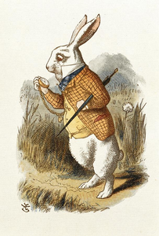
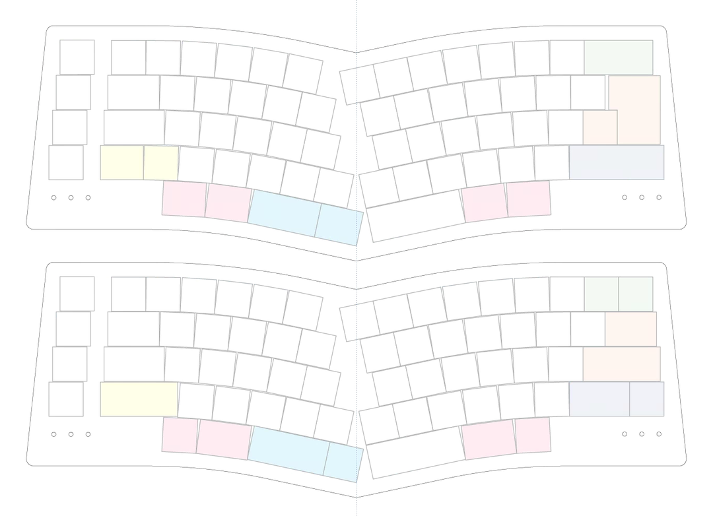

# Rabbit

*“Oh dear! Oh dear! I shall be too late!”*

Rabbit is yet another ergonomic keyboard layout:
* Strongly influenced by:
  * [TGR Alice](https://geekhack.org/index.php?topic=95009.0)
  * [Bemeier BMEK](https://github.com/bemeier/bmek)
  * [HHKB](https://www.hhkeyboard.com/)
* Ergonomic
* Non-split
* Staggered
* More symmetric than Alice, less symmetric than BMEK
* Focus on curved rows (transitioning from 0° to 12°) rather than rotated clusters
* Personal idiosyncrasies (like moving ‘6’ to the right side)
