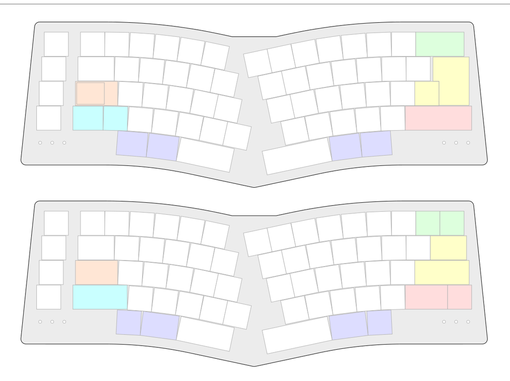

# Rabbit

*“Oh dear! Oh dear! I shall be too late!”*

Rabbit is yet another ergonomic keyboard layout:
* Strongly influenced by:
  * [TGR Alice](https://geekhack.org/index.php?topic=95009.0)
  * [Bemeier BMEK](https://github.com/bemeier/bmek)
  * [HHKB](https://www.hhkeyboard.com/)
  * [Gondolindrim Sagittarius](https://geekhack.org/index.php?topic=107023.0)
  * [Aster Ergo TKL](https://geekhack.org/index.php?topic=116962.0)
* Ergonomic
* Non-split
* Staggered
* More symmetric than Alice, less symmetric than BMEK, less extreme than Sagittarius, more aesthetic than Aster Ergo TKL
* Focus on curved rows (transitioning from 0° to 12°) rather than rotated clusters
* Personal idiosyncrasies – moving ‘6’ back to the right side, removing the extra ‘B’
* Adding in a couple layout options (split/non-split shifts, ISO enter, stepped caps lock)
